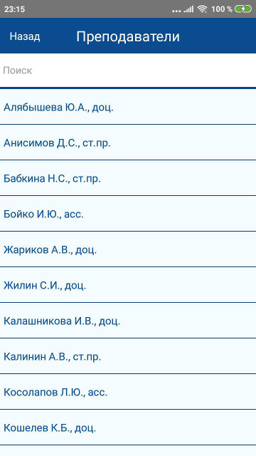
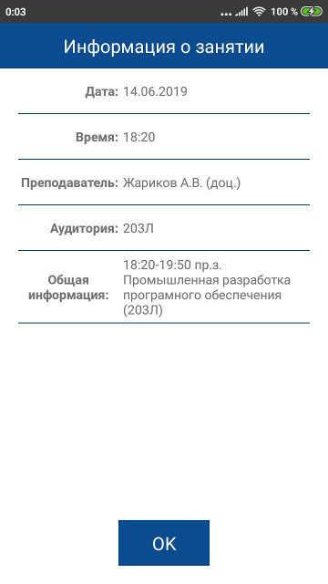

# ASU-Timetable

Приложение для просмотра расписания Алтайского государственного университета.

Возможности:

* Просмотр расписания для групп или преподавателей
* Поиск по факультетам / группаам / кафедрам / преподавателям

Главный экран | Экран выбора факультета
------------ | -------------
 | 

Экран выбора группы | Экран выбора преподавателя
------------ | -------------
 | 

Расписание | Информация о занятии
------------ | -------------
 | 